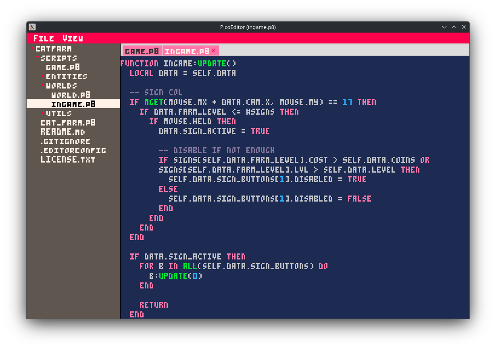

# Pico Editor 

PicoEditor is a small text editor made for Pico8 games!




# Building
This is a java app, so we will need the JDK (21 as of right now).

We also need Git and Maven.

```bash
# Ubuntu
sudo apt install openjdk-21-jdk openjdk-21-jre git maven 

# Arch
sudo pacman -S openjdk-21 git maven
```

Now, we can set up the app.

We start by cloning the github repository.
```bash
git clone https://github.com/EveMeows/PicoEdit.git
cd PicoEdit/
```

We can now run maven commands.
```bash
# First, clean the target directory if it exists.
mvn clean

# Build the FAT JAR.
mvn install

cd target/
java -jar ./PicoEdit-<VERSION>-shaded.jar 
```

# License
GPL 3.0